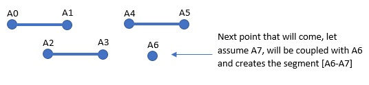

# ejbconcurrency
_ejbconcurrency_ is a small project for checking how container handles EJB transactions in `@Stateless` and `@Singleton` session beans. We see the difference between using `@EntityManager` and  `@Datasource` for database interactions.

# Project structure
The project consists in three modules:
- `ejbconcurrency-server` _EJB_ to be deployed in the _application server_.
- `ejbconcurrency-api` _API_ exposed by the _EJB_ (_Remote_ and _DTOs_ used by the client are located here).
- `ejb-client` _standalone_ java application for testing the _EJB_.

# EJB - Description
_Dashboard_ is a _stateless_ EJB which adds a *point* in the dashboard. If any other free point present, adds a new *segment* between two points. The same point can not be used in two segments.



# EJB - Technical
`@Stateless
DashboardRemote.addPointToDashboard("A1")`  => Adds the segment _[A0-A1]_, with the first free point _A0_ found.
Given a new incoming point *A1*:
- There is any free point *A0* in database? =>  `select * from POINT where rownum=1;`
    - YES
        1. Creates the segment *A0-A1*  => `insert into table SEGMENT(A0, A1)`
        2. Remove *A0* from the temporary table => `delete from POINT where name = 'A0'`
    - NO
        1. Add *A1* to the temporary table => `insert into table POINT values(A1)`
        2. *A1* will be coupled with the next eventually coming point, *A2*.
		
If a client calls `DashboardRemote` and sends a sequence of points, one by one: `A0, A1, A2, A3, A4, A5, A6`. <br/> 
At the end of the computation the data in DB will be as follow:
```
Segments: [A0-A1], [A2-A3], [A4-A5]
Points:   [A6] 
```

## Concurrent scenario
If two clients calling *concurrently* (at the same time) `DashboardRemote` with the following sequences:
```
CLIENT1: A1, A2, A3, A4, A5
CLIENT2: B1, B2, B3, B4, B5
```
At the end of the operation, one possible scenario could be:
```
Segments: [A1-B1], [A2-A3], [B2-A4], [B3-A5], [B4-B5]
```
Calls from _CL1_ and _CL2_ will be processed concurrently so __various coupling(combinations)__ can hapen.<br/>
To each client the container will assign a different instance of the `STLB` from the pool, lets say *INSTACE1* will compute request from *CLIENT1* and *INSTANCE2* will compute request from *CLIENT2*.<br/>
**IMPORTANT:** Same point should not be in two different segments.


## Problem
Consider *A0* is present in `POINT db table` and two new requests are coming, point *A1* from *CLIENT1* and point *B1* from *CLIENT2*.
**Steps** to be done for completing the task on each **SLSB** instance are the following:
1. `select * from POINT where rownum=1`
2. `insert into table SEGMENT(A0, A1)`
3. `delete from POINT where name = 'A0'`

We want:
- Three steps to be in a single transaction, so failure of a single instruction/step will rollback all steps.
- Same _point_ can not be present in two different _segments_.
- We don't want any _point_ to remain uncoupled if another one is free.

We want to avoid this scenario: 
1. _CL1_ executes _step1_, he find _A0_.
2. _CL2_ executes _step1_, he find _A0_   **<= both found _A0_ as free.**
3. _CL1_ executes _step2_   <= _[A0-A1]_ will be inserted in DB. OK
4. _CL2_ executes _step2_   <= _[A0-B1]_ will be inserted in DB. **NOTOK**, _A0_ is not anymore free.

Lets see how the container will handle this situation in different scenarios.  See also [Isolation Levels]

## Test configuration

**SERVER**  <br/>
Between _step1_ and _step2_ we add `Thread.sleep(1000)` in the EJB. 
We assume the computational time from _step1_ to _step2_ is 1 second long.

**CLIENT** <br/>
It creates two Threads, one for client _CLI1_ and one for _CLE2_, which send "_in parallel_" the following sequences to the server:
```
CL1: A1, A2, A3, A4, A5, A6, A7, A8, A9, A10
CL2: B1, B2, B3, B4, B5, B6, B7, B8, B9, B10
```
Use interface `DashboardRemote.java` for calling the EJB, specifying one of the following implementations.

| Different approaches | EJB Implementation |
| ------ | ------ |
| @PersistenceContext EntityManager| DashboardEM.java |
| @Datasource | DashboardDS.java |
| Datasource inside @Singleton | DashboardDSUseSingleton.java |
| EntityManager in ejb-service-dao approach| DashboardEMSafe.java |

### Test 1 - Using EntityManager 
`@PersistenceContext
EntityManager entityManager`

**RESULT**
```
SEGMENTS with no re-send: [A0-B1], [B0-B2], [B3-B4], [B5-A4], [A5-B7], [B8-A7], [A8-A9]
SEGMENTS with re-send:    [A0-B1], [B0-B2], [B3-B4], [B5-B6], [B7-B8], [B9-A1], [A2-A3], [A4-A5], [A6-A7], [A8-A9]
Points:[]   
Missing points with no re-send: A1, A2, A3, A6, B6, B9
Missing points with re-send: 0
```

**OBSERVATION**
- When _transaction(INSTANCE2)_ tries to changes data changed by another _transaction(INSTANCE1)_ in meanwhile, the container throws the exception: <br/>
`javax.ejb.EJBTransactionRolledbackException: Transaction rolled back`<br/> -
`Caused by: javax.transaction.RollbackException: ARJUNA016053: Could not commit transaction.`<br/>-
`...`<br/>-
`Caused by: javax.persistence.OptimisticLockException: org.hibernate.StaleStateException: Batch update returned unexpected row count from update [0]; actual row count: 0; expected: 1`<br/>-
`Caused by: org.hibernate.StaleStateException: Batch update returned unexpected row count from update [0]; actual row count: 0; expected: 1`
- For `consuming` all the points (even the one which failed) in the client we added a re-sending mechanism like: <br/>`while (!success && count < 10) {remote.addPointToDashboard("name");}`. If the bean is a `MDB`there is no need for this mechanism, as MBD (Messaging broker actually) comes with a built-in resending policy, and on `EJBTransactionRolledbackException` the container will resend the message again.

## Test2 - Using Datasource
`@Resource(mappedName = "java:jboss/datasources/ExampleDS")
private DataSource dataSource;`

**RESULT**
```
SEGMENTS:[A0-A1], [A0-B1], [B0-A2], [B0-B2], [B3-A4], [B3-B4], [A3-A5], [A3-B5], [A6-B6], [A7-B7], [A8-B8], [A9-B9]
Points: []
```

**OBSERVATION**
- The result is not correct, **duplicated _points_!**
- `@Datasource` does not offer any isolation level control, so threads/instances are accessing concurrently to the DB tables.
- SOLUTION1: Use DB layer isolation level to avoid _Nonrepeatable_ and _Phantoms Reads_. `select for update` in oracle.
- SOLUTION2: Control the isolation level of the _connection_. Same connection has to be used for all __3 steps__. <br/>
`Connection conn = dataSource.getConnection();` <br/>
`conn.setAutoCommit(false);`<br/>
`conn.setTransactionIsolation(Connection.TRANSACTION_READ_COMMITTED);`<br/>
`step1(conn)`<br/>
`step2(conn)`<br/>
`step3(conn)`<br/>
`conn.commit();`
- SOLUTION3*: Use of Java mechanism to implement _SERIALIZABLE_ isolation level so only one thread at time can execute all transaction steps. Notice that to do so in a `SLSB` we need a synchronized block/method and a _static variable_ to be shared between all instances (to be used like a lock). This approach could be the worse one, since usage of _static variables_ and saving the state in `SLSB` is discouraged by _EJB spec_. Also, locking access never improves on access times. The cleanest way to do it, starting from EJB3.1 is using SL `@Singleton`. (see TEST3)

### TEST3 - Using @Singleton 
Using singleton with `WRITE` lock we make the isolation level to `SERIALIZE`. 

**RESULT**
```
SEGMENTS:  [A0-B0], [A1-A2], [B1-A3], [B2-A4], [B3-A5], [B4-A6], [B5-A7], [B6-A8], [B7-A9], [B8-B9]
Points: []
Missing points: []
```

**Observations**
- Using the highest level of isolation in the method addPointToDashboard we make possible only one thread at a time can access `addPointToDashboard()`.
- Creates a bottle neck, all the threads (clients) have to wait after each other in order to execute the method. 
- Execution time increases to 20 seconds, sending 10 _points_, versus 10 seconds in case of EntityManager. Try running: <br/> 
`$ java -jar dashboardclient.jar 1 10`<br/>
`$ java -jar dashboardclient.jar 3 10`<br/>
- Lose the benefit of having different stateless instances in the pool.


# Conclusions
- `SLSB` is _safe_ in sense that container guarantees only one thread at time can execute a **single instance**. SPEC do not mention that the same method will be called only from 1 instance at time. (controversal answers about this)
- `EntityManager` is reliable. With the default isolation level is enough to avoid data inconsistent. 
- Nice to see how to change isolation level and find an extreme case when needed. Even if from **SPEC 13.3.2** "_Isolation Levels Therefore, the EJB architecture does not define an API for managing isolation levels._"
- A "copy" of `EnityManager` is injected to each `SLBS` instances by the container. Afterwards it is the `EntityManager` who is responsible for data consistency.


## Environment
- Application Server: Jboss7.1.1 run with standalone-full.xml profile
- Datasource: ExampleDS present in standalone-full.xml which connects to in memory H2 database. 

## Deployment
In the _dist_ folder
- dashboardclient.jar      # to test the EJB from the command line
- ejbconcurrency-ear.ear   # to be deployed on jboss
Example, to call the EJB using the implementation with @PersistenceContext use the following command:
```
$ java -jar dashboardclient.jar 1 10
```

# See
* [JSR-318 EJB 3.1 Spec] - Enterprise JavaBean 3.1 Specification (Cap13. Support for Transactions, 13.3.2 Isolation Levels)
* [Adam Bien's weblog] - Is EntityManager Thread Safe?
* [Concurrency in a Singleton] - 34.2.1.2 Managing Concurrent Access in a Singleton Session Bean
* [Isolation Levels] - Real example of _Dirty Read_, _Phantom Read_ and _Non Repeatable Read_
* [Reentrant Lock] - Simple explanation of reentrant locks in Java.
* [OptimisticLockException] - Example when OptimisticLockException is thrown.
* [@Stateless or @Singleton instead of static helper class?]: Stackoverflow post. Reason of this test project.
* [Why Stateless session beans?] - Stackoverflow post. See _BalusC_ and _user698226_ answers.
* [Is EntityManager really thread-safe?]: - Stackoverflow post. See the accepted answer.

[//]: # (These are reference links used in the body of this note and get stripped out when the markdown processor does its job. There is no need to format nicely because it shouldn't be seen. Thanks SO - http://stackoverflow.com/questions/4823468/store-comments-in-markdown-syntax)

   [Stackoverflow]: <https://stackoverflow.com>
   [JSR-318 EJB 3.1 Spec]: <http://download.oracle.com/otndocs/jcp/ejb-3.1-pfd-oth-JSpec/>
   [Adam Bien's weblog]: <http://www.adam-bien.com/roller/abien/entry/is_in_an_ejb_injected>
   [Concurrency in a Singleton]: <https://docs.oracle.com/javaee/7/tutorial/ejb-basicexamples002.htm#JEETT00657!>
   [Reentrant Lock]: <http://tutorials.jenkov.com/java-concurrency/locks.html>
   [Why Stateless session beans?]: <https://stackoverflow.com/questions/5809855/why-stateless-session-beans/31639830#31639830>
   [Is EntityManager really thread-safe?]: <https://stackoverflow.com/questions/24643863/is-entitymanager-really-thread-safe>
   [@Stateless or @Singleton instead of static helper class?]: <https://stackoverflow.com/questions/46655330/stateless-or-singleton-instead-of-static-helper-class/46664872#46664872>
   [OptimisticLockException]: <https://www.mkyong.com/jpa/jpa-optimistic-lock-exception-in-java-development/>
   [Isolation Levels]: <http://javadata.blogspot.be/2011/05/dirty-readphantom-read-and-non.html>
  
   [MD Editor]: <https://dillinger.io/>
   
